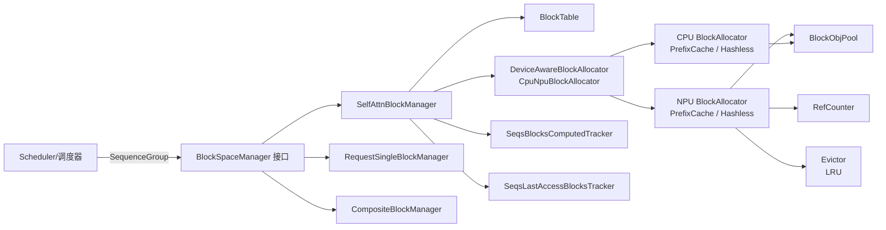
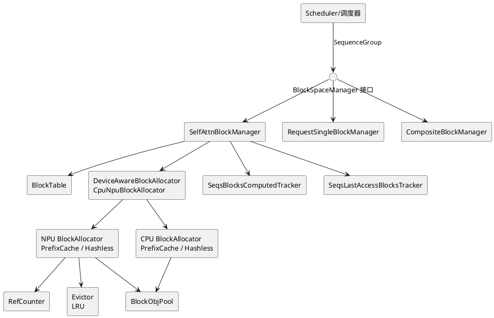
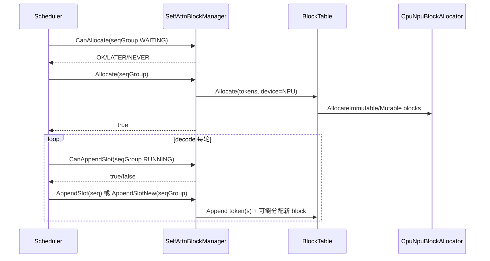
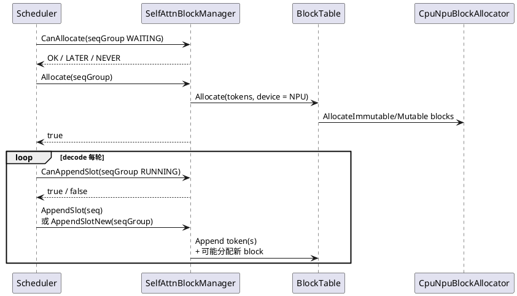
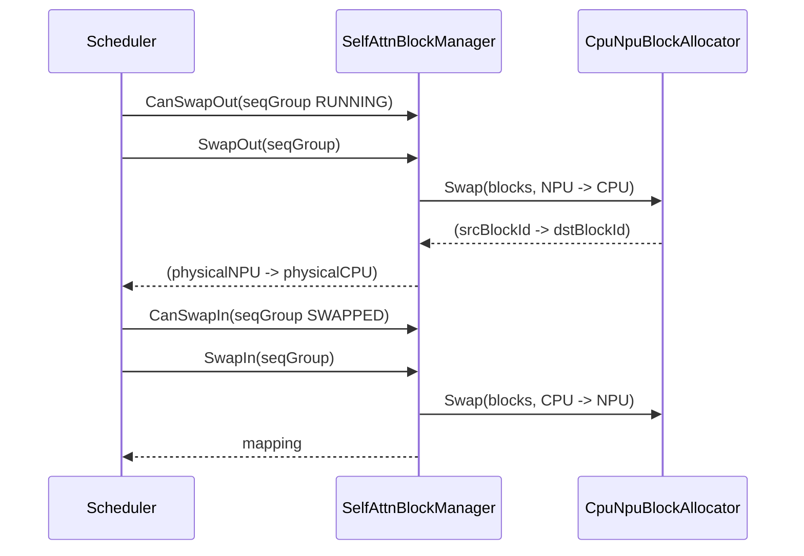
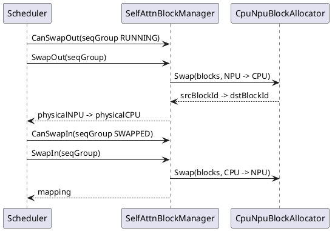
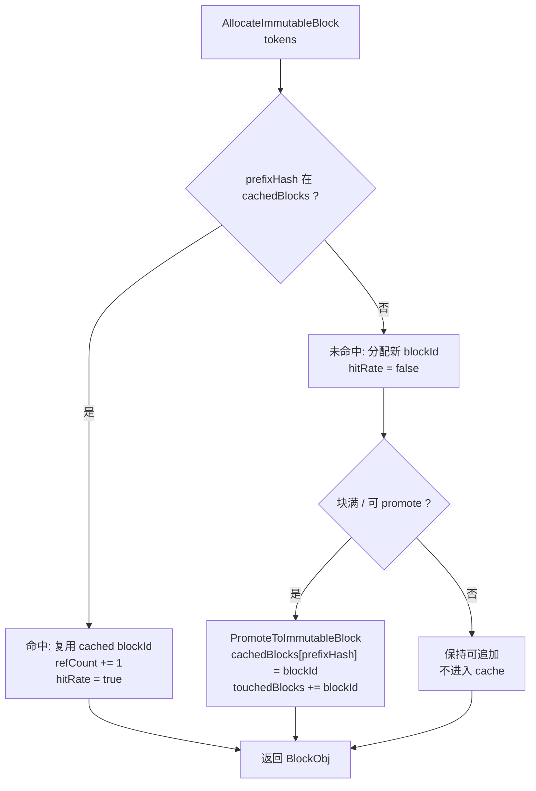
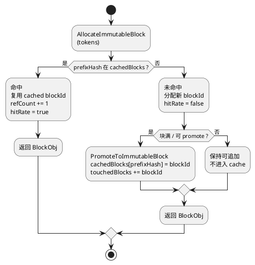

# Block Manager 深度讲解（面向推理框架 + 系统/调度/部署）— 45 分钟材料

> 适用对象：  
> - **A（推理框架/性能）**：关注 prefix cache 命中、KV 复用、吞吐/时延、并发行为  
> - **B（系统/调度/部署）**：关注 swap/抢占、资源隔离、PD 分离/边云、多 rank 限制与扩展点  
>
> 本文基于仓库当前实现梳理：`src/block_manager/` + `src/include/block_manager/` + `tests/dlt/ut/block_manager/`。

---

## 1. 一句话定义：Block Manager 解决什么问题

**Block Manager 的职责**：围绕推理过程中的 **KV Cache**，提供以“Block（固定 token 容量）”为粒度的：
- **分配**（prefill）
- **追加**（decode 每步增长）
- **交换**（NPU↔CPU，缓解显存压力/实现抢占）
- **释放**（请求结束或重算/取消）
- 并在需要时提供 **Prefix Cache（前缀复用）**、**Fork（共享语义）**、**多 rank/SP/CP（并行场景）** 的适配。

---

## 2. 核心概念与术语表（建议做成 1 张 PPT）

- **Block**：固定容量的 KV 存储单元，容量由 `cacheBlockSize` 决定（常见 128）。
- **BlockId（全局）**：全局编号。实现里约定 **NPU blockId 从 0 开始**，CPU blockId 从 `beginCpuBlockId` 开始（见 `CpuNpuBlockAllocator`）。
- **PhysicalBlockId（物理）**：执行侧用于计算地址偏移的编号。CPU 的 `physical = global - beginCpuBlockId`。
- **mutable block vs immutable block**：  
  - mutable：最后一个可追加 token 的块（还有空槽）  
  - immutable：满块（适合被 prefix cache 复用）
- **prefixHash（HashValue）**：由 token 序列（+ extraHash）计算出的 hash，作为 prefix cache 的键。
- **computed / cached**：实现中“可视作 cached”的通常是“computed 的前缀 blocks”（由 tracker + allocator 的 computed 标记共同决定）。
- **Sequence / SequenceGroup**：一个请求（`requestId`）包含一组序列（并行采样/beam 时 >1）。

---

## 3. 代码地图（你讲的时候建议边讲边开文件）

### 3.1 接口与工厂
- `src/include/block_manager/block_manager_interface.h`
  - `BlockSpaceManager`：统一接口（Allocate/Append/Swap/Free…）
  - `BlockManagerConfig`：关键配置
  - `BlockManagerFactory::CreateBlockSpaceManager(...)`：按类型创建具体实现

### 3.2 具体实现（当前最核心的 3 个）
- `src/block_manager/self_attn_block_manager.{h,cpp}`：**主力实现**（token/block 级分配、swap、prefix cache 统计等）
- `src/block_manager/request_single_block_manager.{h,cpp}`：**请求固定 1 block**（更偏 SEQUENCE 级）
- `src/block_manager/composite_block_manager.{h,cpp}`：**多 manager 组合**（多 cacheType 拼装）

### 3.3 关键数据结构 / 算法支撑
- `src/block_manager/block_table.{h,cpp}`：token 切块、分配/追加、rank 轮转等
- `src/block_manager/cpu_npu_block_allocator.{h,cpp}`：CPU/NPU 双 allocator、swap、physicalBlockId
- `src/block_manager/prefix_cache_block_allocator.{h,cpp}`：hash→blockId、refcount、LRU 淘汰、命中率
- `src/block_manager/hashless_block_allocator.{h,cpp}`：无 hash 复用版本
- `src/block_manager/block_tracker.h`：computed/cached 统计与 last access 追踪

### 3.4 单测（讲故事的最好材料）
- `tests/dlt/ut/block_manager/prefix_block_manager_test.cpp`：prefix cache + swapout 场景（全命中/部分命中）
- `tests/dlt/ut/block_manager/hashless_block_manager_test.cpp`：hashless + swapout/swapin 基本行为

---

## 4. 总体架构图（“图片”）

> Mermaid 渲染后就是结构图（飞书/Typora/GitHub 都可直接显示）。

---

## 5. “主线流程”：Allocate → Append → (Swap) → Free

### 5.1 Prefill：Allocate（SelfAttnBlockManager）

**目标**：把 prompt tokens 切成块，分配到 NPU（或按策略分散到多 rank 的 NPU）。

关键行为（建议讲这 4 句话）：
- 从 `SequenceGroup` 取 `WAITING` 的第一个序列（同组序列共享同 prompt）
- 建立 `BlockTable(blockSize, allocator, rankSize)`
- `rankSize==1`：按块大小顺序分配；`rankSize>1`：走 **SmallRankFirst**（优先小 rank）
- 同组多序列会 fork，共享前缀（减少重复占用）

### 5.2 Decode：AppendSlot（追加 token）

**目标**：每轮 decode 追加新 token；必要时再分配新的 mutable block。

两套路径（这是很重要的“坑点”，A/B 都会问）：
- **单 rank**：`CanAppendSlot/AppendSlot` 走传统路径
- **多 rank（SP 专用）**：`CanAppendSlotNew/AppendSlotNew` + `BlockTable::AppendNewTokens`  
  - 支持跨 rank 的 token 追加和预留 slots（`speculativeSlots`）

### 5.3 SwapOut / SwapIn（NPU↔CPU）

**目标（B 最关心）**：显存不足时将某些序列的 blocks 从 NPU 换到 CPU，后续需要时再换回。

关键点：
- swap 的主体在 `CpuNpuBlockAllocator::Swap(...)`：**保留 block 对象语义，替换 blockId 的设备归属**
- `SwapOut`: RUNNING(NPU) → CPU；`SwapIn`: SWAPPED(CPU) → NPU
- 返回映射使用 **PhysicalBlockId**（执行侧用于地址计算）
- **当前实现限制**：`rankSize != 1` 时 swap 直接不支持（SP/CP 场景暂走 recompute/cancel）

### 5.4 Free（释放）

**目标**：请求结束/取消/重算时，把 blocks 释放回 allocator，并更新 tracker（命中率/LRU 统计）。

---

## 6. 时序图（“图片”）：prefill + decode 追加

---

## 7. 时序图（“图片”）：SwapOut / SwapIn

---

## 8. Prefix Cache（A 的核心亮点）：命中/未命中机制图（“图片”）

**你讲的时候建议用 3 句话总结**：
- immutable block 用 hash 做 key，命中则直接复用 blockId（增 refcount），不再占新的 blockId
- free 时如果 refcount 变 0，会进入 evictor（LRU）成为可复用候选
- 没有 free blockId 时，allocator 通过 evictor 选一个可复用的 blockId 来“再分配”

---

## 9. 多 Manager 组合（B 常问）：CompositeBlockManager 的取舍

### 9.1 为什么需要 composite
为了同时管理多种 KV cache 形态（例如 TOKEN 级 + SEQUENCE 级），工厂允许 `config.subManagers` 组合：
- `cacheType == SEQUENCE` → `RequestSingleBlockManager`
- 否则 → `SelfAttnBlockManager`

### 9.2 为什么 composite 明确禁用 swap
因为 swap 的返回 mapping 只包含物理 block id（不带“属于哪个子 manager”的维度），聚合后会 **歧义**。  
因此 composite 的 `SwapIn/SwapOut/GetRankedBlockIds` 等直接不支持/抛异常。

---

## 10. 你可以准备的 Q&A（现场兜底）

- **Q：BlockId vs PhysicalBlockId 为什么要分开？**  
  A：BlockId 是全局逻辑编号（含设备维度），PhysicalBlockId 是执行侧地址偏移编号（CPU 需要减去 beginCpuBlockId）。

- **Q：多 rank 为什么不支持 swap？能不能加？**  
  A：当前 `CpuNpuBlockAllocator::Swap` 对 `rankSize!=1` 直接禁止；要支持需要定义跨 rank 的 swap 语义、以及把 mapping 维度补齐（至少包含 rankId/managerId）。

- **Q：prefix cache “命中”到底省了什么？**  
  A：省掉了为相同前缀重复分配 blockId，以及（配合 computed 标记/上层执行）可减少重复 prefill 计算。

---

## 11. 45 分钟建议讲解节奏（可直接照这个讲）

- **0–5**：KV Cache 背景 + 为什么要 block manager  
- **5–12**：接口与配置（以流程为纲）  
- **12–25**：SelfAttnBlockManager 主线（Allocate/Append/Swap/Free）  
- **25–32**：Prefix Cache（命中/未命中 + refcount + LRU）  
- **32–37**：多 rank/SP 的 AppendSlotNew + 限制点  
- **37–41**：Composite / RequestSingle / LWD（边云）  
- **41–45**：Q&A + 扩展讨论

---

## 12. 渲染说明（如何把“图”变成图片）

- 若你在飞书/语雀/Typora：直接粘贴本文，Mermaid 会自动渲染（或开启 Mermaid 支持）。
- 若你要导出为 PNG：可以用任意 Mermaid 渲染器把代码块导出图片，再放到 PPT。

