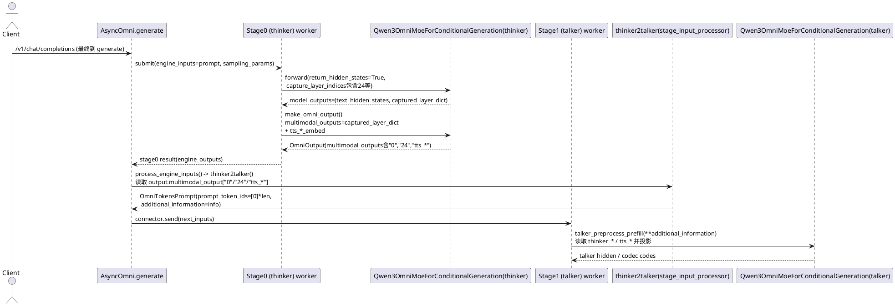

## 核心问题（本次对话解决了什么）

你希望从“代码运行上 + 核心流程上”理解 **vLLM-Omni 如何复用 vLLM**，并进一步把 **Qwen3-Omni 的 thinker→talker 多阶段**里“从 stage0 输出派生 stage1 输入”的策略讲透、闭环到“写出点/读入点”。

---

## 关键知识点（由浅入深）

### 1) 复用 vLLM 的总体方式：打包不声明依赖，但运行时强复用 + monkey-patch

- **打包层面不声明依赖 vllm**：为了避免两者都注册 `vllm` CLI entrypoint 导致覆盖冲突。
  - 证据：`vllm-omni/pyproject.toml` 声明“vllm is intentionally excluded… entrypoints overwrite issue”。（`/mnt/d/github/learning/vllm-omni/pyproject.toml:L32-L36`）
  - 同时 vLLM-Omni 自己也注册 `vllm` 脚本名。（`/mnt/d/github/learning/vllm-omni/pyproject.toml:L79-L82`）

- **源码/运行时强复用**：大量模块直接 `import vllm...`（例如 OpenAI server、EngineClient、Serving 组件等）。
  - 证据：`vllm_omni/entrypoints/openai/api_server.py` 大量 `from vllm... import ...`。（`/mnt/d/github/learning/vllm-omni/vllm_omni/entrypoints/openai/api_server.py:L21-L83`）

- **通过 patch 接管 vLLM 内部类型**：把 vLLM 的 `EngineCoreOutput/Request/TokensPrompt/MRotaryEmbedding/...` 替换为 Omni 版本，确保多模态/多阶段附加字段能穿透既有流程。
  - 证据：`vllm_omni/patch.py` 遍历 `sys.modules`，对所有已加载 `vllm*` 模块做符号替换。（`/mnt/d/github/learning/vllm-omni/vllm_omni/patch.py:L68-L83`）

### 2) CLI 运行时路径：不带 `--omni` 直接转发给上游 vLLM

- **拦截逻辑**：如果 `sys.argv` 没有 `--omni`，直接调用 `vllm.entrypoints.cli.main:main`；带 `--omni` 才进入 Omni 子命令。
  - 证据：`vllm_omni/entrypoints/cli/main.py`。（`/mnt/d/github/learning/vllm-omni/vllm_omni/entrypoints/cli/main.py:L11-L16`）

### 3) Serving 运行时路径：复用 vLLM OpenAI server，但覆盖关键路由

- **server worker 初始化**：用 vLLM 的 `build_openai_app/setup_openai_server/serve_http` 组装与启动；然后移除上游 `/v1/chat/completions` 与 `/v1/models`，再挂载 Omni router。
  - 证据：`vllm_omni/entrypoints/openai/api_server.py`。（`/mnt/d/github/learning/vllm-omni/vllm_omni/entrypoints/openai/api_server.py:L229-L236`）

### 4) 多阶段编排：AsyncOmni 负责 orchestration；每个 LLM stage 内仍跑 vLLM 的 `LLMEngine.step()`

- **stage 初始化分流**：`OmniStage` 根据 `stage_type` 初始化 `OmniDiffusion` 或 `OmniLLM`。
  - 证据：`vllm_omni/entrypoints/omni_stage.py`。（`/mnt/d/github/learning/vllm-omni/vllm_omni/entrypoints/omni_stage.py:L885-L901`）

- **LLM stage 复用内核**：`OmniLLM` 内部创建 vLLM `LLMEngine` 并 `step()` 驱动推理循环。
  - 证据：`vllm_omni/entrypoints/omni_llm.py` 里 `self.llm_engine.step()`。（`/mnt/d/github/learning/vllm-omni/vllm_omni/entrypoints/omni_llm.py:L249-L252`）

---

## 重点闭环：Qwen3-Omni thinker→talker 的“派生策略”与“写入点/读入点”

### A) pipeline 拓扑与派生入口（配置层）

- Qwen3-Omni-MoE 三阶段 pipeline：
  - stage0 thinker：输出 `engine_output_type: latent`（给下游用的隐藏信息/sidecar）
  - stage1 talker：`engine_input_source: [0]` + `custom_process_input_func: ...thinker2talker`
  - stage2 code2wav：`engine_input_source: [1]` + `custom_process_input_func: ...talker2code2wav`
  - 证据：`vllm_omni/model_executor/stage_configs/qwen3_omni_moe.yaml`。（`/mnt/d/github/learning/vllm-omni/vllm_omni/model_executor/stage_configs/qwen3_omni_moe.yaml:L14-L23`、`L58-L60`、`L90-L92`）

### B) stage1 如何从 stage0 输出派生输入（stage_input_processor 层）

- stage1 的自定义派生函数：`vllm_omni/model_executor/stage_input_processors/qwen3_omni.py::thinker2talker`
  - 读：`output.multimodal_output["0"]`、`["24"]`、`["tts_*"]` 等，打包到 `additional_information`
  - 写：`prompt_token_ids=[0]*prompt_len`（占位/对齐），并把真正条件放到 `additional_information=info`
  - 证据：`thinker2talker()` 实现。（`/mnt/d/github/learning/vllm-omni/vllm_omni/model_executor/stage_input_processors/qwen3_omni.py:L154-L210`）

### C) Q1：stage0 的 `multimodal_output` 从哪来（写出点）

- **捕获隐藏状态**：thinker forward 会返回 `(hidden_states, captured_hidden_states)`；其中 `captured_hidden_states` 按 layer_idx 以字符串 key 保存（例如 `"24"`）。
  - 证据：捕获逻辑。（`/mnt/d/github/learning/vllm-omni/vllm_omni/model_executor/models/qwen3_omni/qwen3_omni_moe_thinker.py:L250-L273`、`L1088-L1102`）

- **组装 multimodal_outputs**：unified 模型在 `make_omni_output()`（thinker 分支）里把 `captured_layer_dict` 作为 `multimodal_outputs` 基础，并额外计算 thinker 侧 `tts_bos/eos/pad` embedding 写入 `multimodal_outputs["tts_*"]`。
  - 证据：`make_omni_output()` thinker 分支。（`/mnt/d/github/learning/vllm-omni/vllm_omni/model_executor/models/qwen3_omni/qwen3_omni.py:L402-L426`）

### D) Q2：talker 如何消费 `additional_information`（读入点）

- talker stage 启用自定义 preprocess：`self.set_custom_preprocess(self.talker_preprocess)`。
  - 证据：talker stage init。（`/mnt/d/github/learning/vllm-omni/vllm_omni/model_executor/models/qwen3_omni/qwen3_omni.py:L135-L140`）

- `talker_preprocess_prefill()` 会从 `info_dict`（即每个请求的 `additional_information`）读取：
  - `thinker_prefill_embeddings`
  - `thinker_hidden_states`
  - `thinker_sequences / thinker_input_ids`
  - `tts_bos_embed / tts_eos_embed / tts_pad_embed`
  并调用 `_thinker_to_talker_prefill(...)` 把 thinker 输出投影/对齐成 talker 可用的 `req_input_ids/req_embeds`。
  - 证据：字段读取与调用链。（`/mnt/d/github/learning/vllm-omni/vllm_omni/model_executor/models/qwen3_omni/qwen3_omni.py:L683-L751`）

---

## 流程图（PlantUML）：一次请求如何触发 thinker→talker 派生

---

## TODOs（后续可继续深挖）

- **确认 `"0"` 这个 key 的精确定义**：它在实际运行时是否代表“输入 embedding / 某层 hidden / 特定 capture 输出”，需要进一步顺着 `engine_output_type: latent` 的输出装配路径追到生成 `captured_layer_dict` 的上游（vLLM-Omni output pipeline）。
- **把 `_thinker_to_talker_prefill()` 的投影/对齐细节走读**：它如何使用 `thinker_sequences/thinker_input_ids` 切分对话段落，如何注入 speaker/token embedding。
- **补一份“字段字典”**：把 `additional_information` 中每个 key 的 shape、device、dtype 统一列出来，便于调试（尤其是跨进程/跨机 connector 传输时）。

